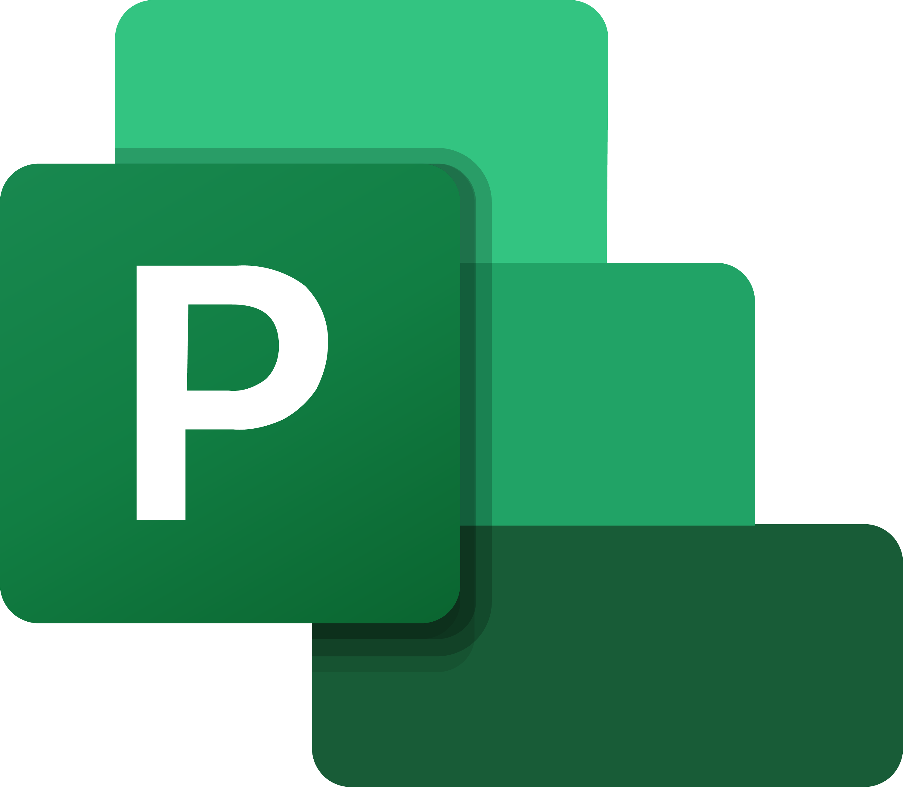

  ## Analista de Dados • Business Intelligence • Data Science 

  **Transformando dados em decisões inteligentes**
  
  ##   

</a>

  ##  Sobre mim
  

  Profissional com **+20 anos de experiência em TI**,atuando de técnico a gerente.*  
  Atualmente em transição para **Business Intelligence & Data Science** com foco em **Power BI, Python, R e SQL**  
 Perfil completo no    

  
  ##  Objetivo 

1. **Aprimorar conhecimentos em Análise de Dados**
2. **Ingressar no mercado de BI & Data Science, iniciando um novo ciclo de evolução profissional.**

  ##    Portfólio
  

###### Clique para ver o submenu

<strong> Power BI </strong>

- [Microsoft Power BI Para Business Intelligence e Data Science](https://github.com/mslicinio/PowerBI_DSA) → Microsoft Power BI com técnicas de Data Science e integrando o Power BI com Linguagem R e Python.
- [Primeiros Passos em Power BI](https://github.com/mslicinio/dashboard_porsche_sales) → organize, explore e visualize dados reais usando Pandas.

<strong> Python </strong>

- [Do zero à análise completa](https://github.com/mslicinio/dashboard_porsche_sales) → LangChain, Hugging Face, CrewAI, APIs da OpenAI e dezenas de projetos práticos.

<strong> Excel </strong>

- [Excel com IA e Claude](https://github.com/mslicinio/dashboard_porsche_sales) → Excel 365, Power Query, Microsoft Copilot e agentes de IA com projetos reais, mentorias ao vivo e certificado.

    (em breve: projetos em Python, SQL e R)

---
##  Cursos na Fila

| Curso | Status | Previsão |
| :--- | :--- | :--- |
| **Santander Excel com IA e Claude**| ⏸️ Em Espera | Junho 2026 |
| **SQL** | ⏸️ Em Espera | Segundo Semestre |
| **Excel**| ⏳ Programado | A definir |
| **Universia - Primeiros Passos em Power BI**| Cursando| 
| **Power BI Para Business Intelligence e Data Science**|Cusando
---

##   Tecnologias

###  Business Intelligence & Data Science

  
  
  
  

###  Infraestrutura & Sistemas

 

 
###  Gestão & Metodologias

---

 
 👻 🟡 👾 Pacman Contrib Graph 👾 🟡 👻 <a href="https://github.com/actions-marketplace-validations/abozanona_pacman-contribution-graph" target="_blank">Official REPO
 

<picture>
  <source media="(prefers-color-scheme: dark)" srcset="https://raw.githubusercontent.com/mslicinio/mslicinio/pacman-output/pacman-contribution-graph-dark.svg">
  <source media="(prefers-color-scheme: light)" srcset="https://raw.githubusercontent.com/mslicinio/mslicinio/pacman-output/pacman-contribution-graph.svg">
  
</picture>

--- 

###  Contato  
  
  

---

✨ *“Transformando dados em decisões inteligentes.”*
